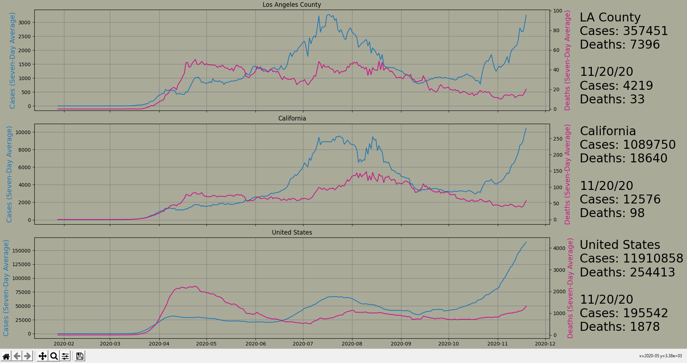

# COVID19Dashboard

A COVID-19 Dashboard visualizing data at the county, state, and national level.

Used Python, along with the pandas and matplotlib libraries

Data Attribution: [COVID-19 Data Repository by the Center for Systems Science and Engineering (CSSE) at Johns Hopkins University](https://github.com/CSSEGISandData/COVID-19) under the Creative Commons Attribution 4.0 International (CC BY 4.0)
